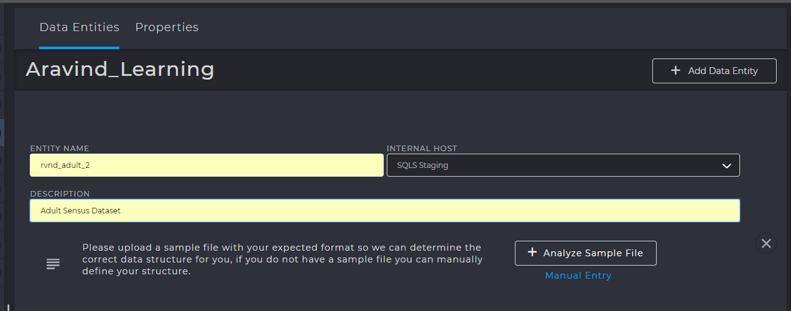
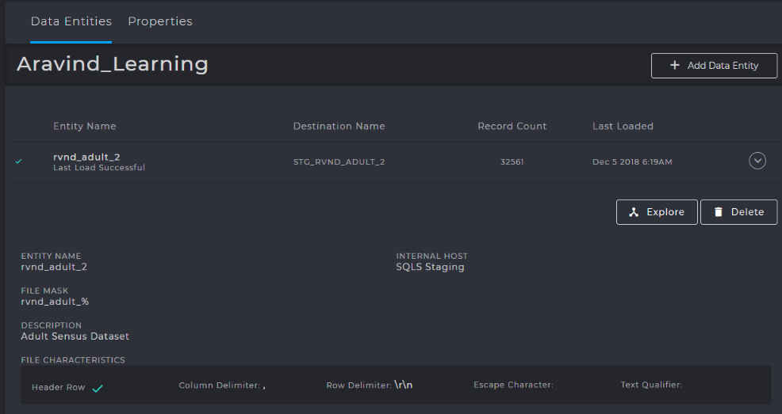

Datasets & Data Entities
########################

Terminology
***********

Dataset
=======
**A dataset can be thought of as an entity that contains a set of related data elements.**
For example, a table or file containing records, or a file containing a stream of related data with a natural start and end point, such as an image.
It can be either structured or unstructured. Structured datasets are usually presented in tabular form with each column representing a particular variable. 
Each row may represent a given member of the dataset in question and would describe the various variables which represent that member. 
A dataset can be a file that is ingested from an external source or a table containing data that is derived after performing various operations on other datasets

Dataset Instance
================
Strictly speaking, the term dataset represents the definition of a dataset; the type and structure of the data but not the data itself.
A dataset instance is a specific “chunk” of data. For example, a table dataset defines a structure of records with certain fields, each with its own data type and intended content.
A dataset instance represents the actual data that populates the fields within the records of the table. This follows the object-oriented class and object instance model where many instances of the same class are generated.
In fact, the term “type” is often used to distinguish between datasets and dataset instances, conversationally; one might refer to an instance of a particular dataset type. For example, a set of related rows in a particular table would be considered as an instance of the dataset represented by that table. 
Another example would a type of file that is received by an external source on a repeating basis. 
The type of file is the dataset; the actual file delivered on any given day is the dataset instance

|   Once you have created a Data Provider, you need to add a Data Entity (or entities) to it.

Staging
=======
Staging is defined as the action of loading a dataset from a file and creating a “workspace table”. 
This table is the starting point of all future workflows, transformations and operations. A staging table is created automatically when a data entity is added. 
All staging tables are present in the STAGING database named ``EnvironmentName_staging``.
For example, ``CDPTraining01_staging`` database contains all databases loaded for training under the CDPTraining01 environment. All staging tables after being loaded are appended with the prefix ``STG_`` before the table name.

.. admonition:: PRIMARY TABLES

    :any:`M_DATASET <M_DATASET>` , :any:`M_SOURCE_ENTITY <M_SOURCE_ENTITY>`

Front End Configuration
***********************
Select any Data Provider and click ::guilabel:`Add Data Entity` to configure an Entity

UI Options
==========

ANALYZE SAMPLE FILE
^^^^^^^^^^^^^^^^^^^^
This function allows you to choose a source file sample from which the data fields, the header rows and the basic table definitions can be read.
Remember that this file is only a sample from which a structure must be read, not the data itself. 
QCDP does not read the data or ingest it at this point, but merely requires the table definition before it can begin ingestion
(Extract process in ETL).

.. caution:: 
    When you select the file to be analyzed, QCDP downloads the sample file and only then begins reading it. 
    Therefore, providing a large dataset as a sample file will take very long to read and it is best to provide only a subset of the dataset,
    keeping in mind the following scenarios :

    •	If you choose the select the first 10-15 rows as a sample subset, remember that there may be a column with only 0 in the first 1000
        rows and floating-point numbers later. If you proceed with sampling the first 10-15 rows,
        then QCDP may assign BIGINT datatype instead of FLOAT or DOUBLE because it is not aware of the actual datatype of the column
    •	If you choose to select very few rows, QCDP may not have enough data to identify the appropriate data types of all the fields
        (a special case of the first scenario)

    It is best to select a sample of data that contains the datatypes representing the normal distribution of the entire dataset.

DATA FIELDS
^^^^^^^^^^^^^^^^^^^
Data fields are column specifications that are either entered manually or automatically by analyzing a sample file.

.. warning::
    The following points must be kept in mind when entering data fields

    •	SQL Server has reserved keywords that are NOT ALLOWED to be used as column names.
        If an entity is created for Staging, then any reserved keyword is appended with the ``_`` underscore suffix.
        For example, a column named ``date`` will become ``date_`` during staging.
        Please do note that this appending is done only for STAGING tables and not for MASTERING or MART tables.
        Using reserved keywords in mastering tables will throw an error during the creation of workflows.
        You can find all the reserved keywords in the metastore table ``M_RESERVED_KEYWORD``
        
    •	The length of the datatype is selected automatically, when you choose the datatype. 
        Pease note that for ``VARCHAR`` datatype, length SHOULD NOT EXCEED 4000, due to SQL Server limitations.
        Despite 4000 being the limit, it is necessary to only set a length that is sufficient to solve the business problem,
        because at times when more than one primary key must be specified for a table, the following exception is thrown if the 
        primary key size exceeds 900 bytes (if PK is of ``VARCHAR`` type)

        .. error::
           Total size of an index or primary key cannot exceed 900 bytes.

FILE MASK
^^^^^^^^^
|   This option represents the name of the file that is to be loaded or staged. 
    But filenames do not stay constant and change usually based on a given pattern. 
|   For example, a dataset named ``employees.csv`` is meant to be loaded and staged every 2 hours.
    In such cases the date or a timestamp is appended as a suffix after the file name, ``employees_2018_12_07_11_15.csv``.
    In this case, we have a file that was placed on 2018-12-07 at 11:15am.

|   For such files we define a file mask - ``employees_%``, where the ``%`` indicates zero or more characters following ``employees_``.
    In the backend, a ``LIKE`` operator is used against this expression to read these files. It is the same as saying Load and stage all files starting with ``employees_``.
|   Please note, that new files are added each time fresh data is available and so each file can be uniquely identified, 
    and previous files either remain or get deleted during routine cleanup.

COLUMN DELIMITER
^^^^^^^^^^^^^^^^
|   Represents how the columns are separated inside the file.
|   For example, you need to import a text file that is comma delimited (commas separate the different fields that will be placed in adjacent cells). Assume that this file also has a field that has a comma in it
|   To handle cases where you need to import a comma delimited file (commas separate the different fields that will be placed in adjacent cells),
    and the fields themselves contain commas as part of their data, we use column delimiter as ``,`` (comma)

TEXT QUALIFIER
^^^^^^^^^^^^^^^^
|   In some source files, text is enclosed within single or double quotes. A text qualifier is a symbol that lets Excel/CDP know where text begins and ends.
    It is used specifically while importing data.
|   If a file has such quotes or any other character representing strings, 
    we specify them as a ``TEXT_QUALIFIER``. CDP gets rid of the quotes and loads the text directly to the target tables.
    By default, the datatype is STRING and is defined in ``M_SOURCE_ENTITY_DATASET_DATATYPE_MAP``.
|   In the following sample table, the TEXT_QUALIFIER is ``"`` (double quote)

======  =============  ==========
Index   First Name     Last Name
======  =============  ==========
1001    "Aravind"       "Balaji"
1002    "Vaishnavi"     "Gururaj"
======  =============  ==========

ROW DELIMITER
^^^^^^^^^^^^^
Represents how the rows are separated inside the file

INCLUDE HEADER
^^^^^^^^^^^^^^
If enabled, first line in a file is considered a header (column names) and if disabled, they're considered as first-row data.

.. admonition:: TABLES INVOLVED

   :any:`M_SOURCE_ENTITY_DATASET_DATATYPE_MAP <M_SOURCE_ENTITY_DATASET_DATATYPE_MAP>` , :any:`M_RESERVED_KEYWORD <M_RESERVED_KEYWORD>`

Dataset Operations
******************

Modify Dataset Properties
=============================
If you wish to modify the datatype, name, length or any table properties after its creation,
you must do so from the backend by using the tables below and following the steps.

======================================  =============== ========================
Required Tables	                        Modify Staging  Modify Mastering & Mart
======================================  =============== ========================
M_DATASET	                            Req	            Req.
M_SOURCE_ENTITY	                        Req.	        --
M_DATATYPE_REGEX	                    Reference	    Reference.
M_DATASET_DATATYPE_MAP	                Req.	        Req.
M_SOURCE_ENTITY_DATASET_DATATYPE_MAP	Req.	        --
======================================  =============== ========================

1.	Obtain the ``DATASET_ID`` from the ``M_DATASET`` table whose data fields you wish to modify. 
2.	The ``M_DATATYPE_REGEX`` contains all available datatypes, their regular expression and their ID. Note down the datatype and the ID that you wish to convert to. If you’re not modifying datatypes, skip this step.
3.	``M_DATASET_DATATYPE_MAP`` contains details of all the columns, their datatypes, length, scale, primary keys, etc. for any given dataset. This table maybe either mastering or even mart.
4.	``M_SOURCE_ENTITY_DATASET_DATATYPE_MAP`` contains the mapping of all columns, datatypes, length scale, primary keys, etc. for staging tables. This table is used to map from source file to the staging table. For example, this is where the ``_`` is appended to all columns that are reserved keywords
5.	Modify the primary key and data columns in the ``M_DATASET`` using the same ID, if required
6.	Use ``UPDATE`` command to make the required changes.
7.	After performing the above, navigate to STAGING or MASTERING database and change the properties manually. The above tables merely modify the entries, but the actual table present in staging or mastering database must also be changed without fail.

.. admonition:: TABLES INVOLVED

    :any:`M_DATASET_DATATYPE_MAP <M_DATASET_DATATYPE_MAP>` , :any:`M_DATATYPE_REGEX <M_DATATYPE_REGEX>`

Restore Datasets/Entities
=============================

If you accidently delete a dataset or entity from the front end, the tables will merely be deactivated,
and their ``ACTIVE_FLG`` set to ``0``. The actual tables with all the data will still exist in the backend. 
This is to prevent accidental deletions. If you delete a table or entity by mistake, you can restore
them by setting ``ACTIVE_FLG`` to ``1``, by executing the following query.  For staging tables, you’ll have to
update even the ``M_SOURCE_ENTITY`` table along with ``M_DATASET``

.. code-block:: SQL
   :linenos:

   declare @dataset_id bigint
   set @dataset_id = 1******25	   --INSERT YOUR DATASET_ID
   update M_DATASET set ACTIVE_FLG = 1 where DATASET_ID = @dataset_id

   --For staging datasets, also execute the following
   update M_SOURCE_ENTITY set ACTIVE_FLG = 1 where DATASET_ID = @dataset_id 

Delete Datasets/Entities
=============================

If you wish to delete a table permanently, use the following table requirements.

======================================  =============== ========================
Required Tables	                        Delete Staging  Delete Mastering & Mart
======================================  =============== ========================
M_DATASET	                            Req	            Req.
M_SOURCE_ENTITY	                        Req.	        --
Any workflows connected to your table must also be deleted
================================================================================

Perform the following steps carefully, if you wish to delete the tables permanently.

1.	Obtain the ``DATASET_ID`` of the dataset that you wish to delete. 
2.	Delete all rows with the above ``DATASET_ID`` from the table ``M_DATASET``. If you’re deleting a staging table, you must additionally delete the rows present in ``M_SOURCE_ENTITY`` with the ``DATASET_ID``
3.	Additionally, if your table was connected to any workflows, these must also be deleted, since the workflow will fail because of the absence of the table. Depending on how many workflows are connected, either to or from the table, you must identify the any workflows and delete them correspond to the ``DATASET_ID`` that you’re deleting on. You can use the following stored procedure to delete a workflow. ‘n’ represents debug mode which simply displays the changes without deletion.

    .. code-block:: SQL  
 
       EXEC USP_DELETE_WORKFLOW_CONFIG 100000xxxx, 'n'  --Provide Workflow_ID

4.	Once the entries have been deleted, you must go to the STAGING or MASTERING database and delete the fact table from there as well. Without this, the original data will still be present, without the entries, thereby taking up space.

.. warning:: 
   If you fail to perform all the above-mentioned steps for deletion, the “Lineage” section for 
   your datasets will not load and will appear blank. If you notice this happening, it is caused due
   to incomplete deletion of either workflows or datasets. In such cases, attempt to re-delete properly
   using all required tables

.. admonition:: TABLES INVOLVED

   :any:`M_SOURCE_ENTITY <M_SOURCE_ENTITY>`

Metastore Tables
****************

 

.. _M_SOURCE_ENTITY:

M_SOURCE_ENTITY
================
When a file is being staged, an ENTITY must be created from the front end. When an entity is created a record is inserted into this table. 
This table contains details such as the source file name, Dataset ID, description, header option, frequency of scan, file source mask, and other features. 

:any:`SOURCE_FILE_MASK`
    Contains the :ref:`file mask` of the source file

:any:`COLUMN_DELIMITER`
    Specifies the column delimiter

:any:`TEXT_QUALIFIER`
    Specifies the text qualifier

:any:`ROW_DELIMITER`
    Specifies the row delimiter

:any:`UNZIP_FILE_FLAG`
    If set to 1, then the file is considered to be a zipped file and is automatically unzipped.
    If set to 0, it does not perform the unzipping and directly attempts to read the file.

:any:`HEADER_EXCLUDE_EXPRESSION`
    If ``INCLUDE_HEADER`` is set to 0 or if ``NUM_HEADER_ROWS`` is 0, then this expression represents the pattern of the header row and is excluded while loading the file.
    If a header is included, this attribute is NULL.

.. _M_SOURCE_ENTITY_DATASET_DATATYPE_MAP:

M_SOURCE_ENTITY_DATASET_DATATYPE_MAP
=====================================
|   During staging, it becomes necessary to identify the datatypes in the file and map them to the datatypes in the staging table.
|   In the user interface, when you select an entity, the table details are displayed, with attributes, datatypes their length etc. and these details are obtained from :guilabel:`Analyzing Sample File`
|   So, for every attribute in the dataset a ``DATATYPE_ID`` is assigned. Along with this, other properties such as the length of the datatype, scale, creation timestamp are also present.

.. _M_DATATYPE_REGEX:

M_DATATYPE_REGEX
====================
|   During the usage of CDP, the file maybe staged into various platforms such as SQL, Hive etc. and these may have various equivalent datatypes corresponding to the input file.
|   Every datatype can be represented as a Regular Expression and therefore a table of all datatypes, their regular expressions, along with their equivalent datatypes in other platforms is necessary and thus the ``M_DATATYPE_REGEX`` table contains all those details. The ``DATATYPE_ID`` uniquely identifies each datatype and is used when performing the datatype mapping during staging as explained above.

