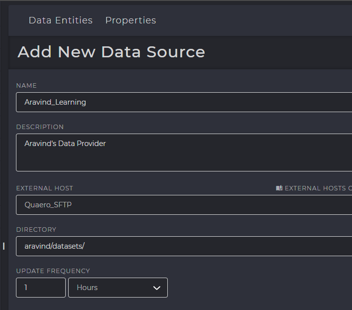

Data Providers
###########################

A Data Provider is an instance of the location where your data is stored. This is done after :doc:`configuring your host <host_config>`.
For example, Quaero-SFTP is the name of the SFTP server where your data is located and is defined as the “HOST”.
A folder named “john/datasets/” contains your dataset files and this directory is the path within your Quaero SFTP Server.
This instance of the “datasets” folder is considered as the Data Provider.
After creation of the Data provider, it is constantly scanned for new files within a specified interval. 
The data providers when created, add a record into the ``M_SOURCE_SYSTEM`` table

.. admonition:: PRIMARY TABLES

   :any:`M_SOURCE_SYSTEM <M_SOURCE_SYSTEM>`

Front End Configuration
***********************
In the Data Lake section, Data Providers can be added by clicking the **[+]** icon at the top

Backend Configuration & Metastore Tables
****************************************

.. _M_SOURCE_SYSTEM:

M_SOURCE_SYSTEM
====================================================

|   This table contains all the “Data Provider” details, and a new record is inserted every time a new data provider is created
    Attributes contain information of the source system such as username, password and host address.
|   It also contains other attributes as follows.

:any:`DATA_INGESTION_PROTOCOL`
    Specifies where the file is present and which protocol is to be used while downloading the file.
    Example, a file that is stored in an SFTP server will have this value as “SFTP” referring to SSH File Transfer Protocol.

:any:`FTP_SITE`
    The host address of the sftp server. Example: sbsftp.quaero.com

:any:`FTP_USER`
    Specifies the username of the SFTP server required during login. Example ``quaero\balajia``

:any:`FTP_PASSWORD`
    Specifies the password of the SFTP user, required during login. Please note that the passwords are not stored verbatim and are initially encrypted and stored in a hexadecimal format.

    .. seealso:: Please see :ref:`enc_dec`.

:any:`SOURCE_SYSTEM_TIME_BETWEEN_SCAN_SECS`
    The value specified for “Update Frequency” in the user interface during data provider creation is converted to seconds and updated in this attribute. This value specifies how many seconds must elapse after each time the source system scans for new files. 
    
.. warning::    
    Setting the interval between scans too low is CPU intensive and results in high memory usage. Please refrain from setting the interval in seconds or minutes, unless absolutely required.

:any:`RECEIVE_DIRECTORY`
    If the source file to be read is zipped or compressed, then this attribute specifies the location to which the file must be downloaded from the source system and moved to this directory and unzipped. After unzipping is performed, the file is then moved to the location specified by ``WORK_DIRECTORY``. Whether the source file is zipped or not is identified by the value of ``UNZIP_FILE_FLAG`` attribute in ``M_SOURCE_ENTITY`` table.

:any:`ARCHIVE_DIRECTORY`
    Specifies the location where files are archived after being staged or processed.

:any:`LOG_FILE_DIRECTORY`
    Specifies the location of the logs. These logs are required in case there are errors during unzipping such as wrong password for unzipping operation, and other scenarios.

.. _enc_dec:

Encrypting & Decrypting Passwords
*********************************

**Encryption** 

.. code-block:: SQL   
   :linenos:   

   OPEN SYMMETRIC KEY PasswordKey DECRYPTION
   BY CERTIFICATE PasswordEncryptionCertificate
   update M_HOST
   set HOST_PASSWORD=ENCRYPTBYKEY(KEY_GUID('PasswordKey'), 'MyPassword')
   where host_id = 999
   CLOSE SYMMETRIC KEY PasswordKey
   
**Decryption** 

.. code-block:: SQL   
   :linenos:   
   
   OPEN SYMMETRIC KEY PasswordKey DECRYPTION
   BY CERTIFICATE PasswordEncryptionCertificate
   select ISNULL(CAST(DECRYPTBYKEY(HOST_PASSWORD) AS VARCHAR(100)),'') AS HOST_PASSWORD
   from M_HOST
   where host_id = 999
   CLOSE SYMMETRIC KEY PasswordKey
