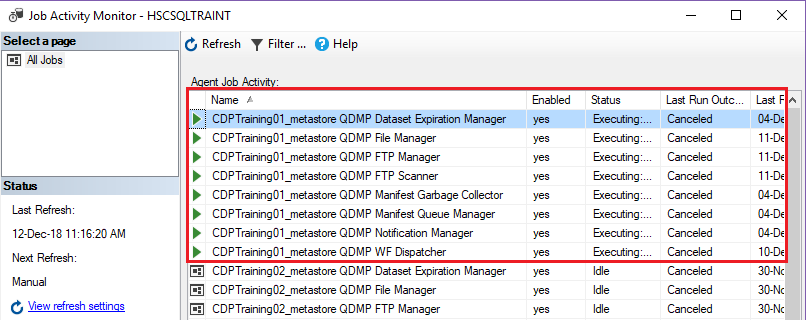
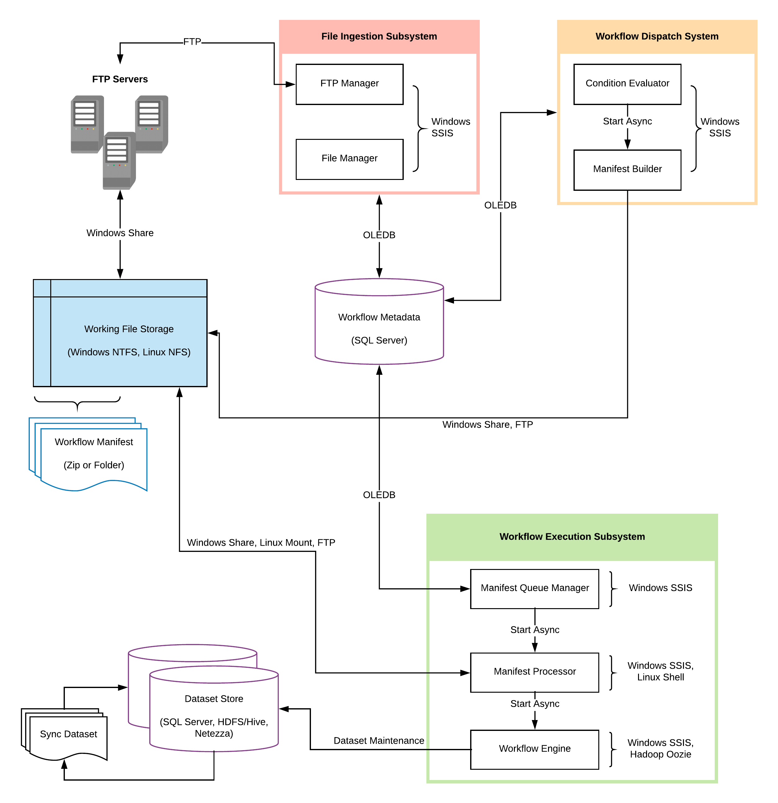

Execution Sequence
##################

We shall now see how Quaero CDP executes workflows and performs operations on data and also how the entire system works together
by orchestrating the various components 

CDP Daemons
***********

Jobs
====
In database engineering terms, a job is a background process that is executed by an SQL Agent in SQL Server. 
The agent is responsible for scheduling jobs and handles other automated tasks. Jobs may involve the running of queries or 
execution of SSIS packages.

Daemon
======
In database engineering terms, a job is a background process that is executed by an SQL Agent in SQL Server. The agent is responsible 
for scheduling jobs and handles other automated tasks. Jobs may involve the running of queries or execution of SSIS packages.

CDP Daemons
===========
The CDP Environment also has multiple daemons and jobs running in the background. 
The following figure shows a snapshot of Job Activity Monitor in the CDP Environment. It can be viewed through SQL Server Management Studio.

==========================  =========================================================================================================================
Daemon Job                   Purpose
==========================  =========================================================================================================================
FTP Scanner	                Checks for file availability and inserts tacking data
FTP Manager	                Downloads (ingests) the “Ready” files into RECEIVE folder
File Manager	            Performs operations like zipping/unzipping, moving files into work folder, inserting metadata for processing the file.
Manifest Queue Manager  	Manifests are queued for execution after being built 
Workflow Dispatcher	        Constantly evaluates dispatch condition of all “READY” workflows and executes (dispatches) them when conditions are met.
Notification Manager	    Responsible for sending mails, error logs, and other notifications
Dataset Expiration Manager	Drops/Truncates tables that are expired during routine cleanup
Manifest Garbage Collector	Deletes manifests of workflows whose status is “PendingCleanup” 
==========================  =========================================================================================================================

The QCDP Execution System
**************************

There are three main subsystems that make up the whole of QCDP:

1.	File Ingestion Subsystem
2.	Workflow Dispatch Subsystem
3.	Workflow Execution Subsystem

File Ingestion Subsystem
========================

.. danger::
   This section (File Ingestion Subsystem) is yet to be reviewed by technical experts and
   so any information here may be fully or partially incorrect. It is therefore advised that this information should not be used in Project implementation and other actions that depend
   on the accuracy of this information

The purpose of this subsystem is to recognize the availability of new data files and ingest them into the QCDP workflow system.
This includes operations such as interacting with internal and external FTP sites, AWS, Google Cloud Store or even External API , 
downloading, decrypting, decompressing (e.g. unzipping) files and cataloging them in the workflow metadata as datasets (or dataset instances 
to be precise).  	

FTP Scanner
-----------

•	This job periodically checks for the availability of the new files in the specified FTP/FTPS/SFTP site. 
•	The interval is specified by ``SOURCE_SYSTEM_TIME_BETWEEN_SCAN_SECS``.
•	Location of the FTP server such as host name username, password and other attributes are specified in the  ``M_SOURCE_SYSTEM`` metastore table and at every interval performs a login and scans the folders
•	The FTP Scanner iterates through all the files and adds the tracking information in the ``M_TRACK_FTP`` table.
•	If a file was already ingested, the corresponding file’s STATUS attribute is set to ``Previously Received``. If the file is new and it is about to be ingested, it is set to ``Ready``. After ingestion, the status is set to ``Preparation Complete``
•	If the file has already been ingested the scanner adds another record, sets status to ``Previously Received`` and proceeds to read the next file, or the job “sleeps” until the next scheduled run.

FTP Manager
-----------

•	The FTP manager constantly checks the ``M_TRACK_FTP`` table for any new files that are in the ``Ready`` Status.
•	The FTP manager then performs the downloading of the ready files into the RECEIVED folder. It later adds metadata record about the file into the ``M_TRACK_FILE`` table, such as creation date, file name, file size and status.
•	When the download completes successfully the ``M_TRACK_FILE STATUS`` attribute is set to ``Received`` and ``M_TRACK_FTP STATUS`` is set to ``Preparation Complete`` 

File Manager
------------

•	The file manager job constantly checks the received folder for any files that were downloaded.
•	If any files were found, the ``M_SOURCE_ENTITY`` table is checked for the ``UNIZIP_FILE_FLG``. If its set to 1, unzipping is performed by the file manager using the password specified in ``UNZIP_FILE_PASSWORD``, unless it is ``NULL``.
•	If any file manager operation fails such as unzipping or wrong password, log entries are made whose location is specified in ``LOG_FILE_DIRECTORY`` attribute of ``M_SOURCE_SYSTEM`` table
•	After extraction is complete (if required), the final file is moved to the WORK directory whose path is specified by the WORK_DIRECTORY attribute in ``M_SOURCE_SYSTEM`` table.
•	Finally, metadata about the file is added to ``M_TRACK_DATASET_INSTANCE`` for processing

Workflow Dispatch System
========================

The purpose of this subsystem is to evaluate workflow conditions and dispatch workflows to the appropriate workflow execution subsystem 
when they meet the pre-defined conditions.  This involves evaluation of schedule and dataset state conditions, packaging and
transmission of workflow definition files and optionally, data files to the target workflow execution subsystem. 

.. glossary::
    Condition Evaluator
        |   The condition evaluator component is responsible for constantly checking workflows’ conditions.
        |   Example, the condition evaluator checks all Active workflows to see if their dispatch conditions are met. If they return true, the workflow execution subsystem begins the execution of the workflow
        |   The conditional evaluator also has other condition types such as System Conditions, time window conditions, and custom user-conditions. 

``This section will be updated when further information is available. Please check back later``

Workflow Dispatch System
========================

The purpose of this subsystem is to execute workflows, consuming input datasets and creating output datasets, both 
of taking the form of files or tables.  It is also responsible for synchronizing datasets between disparate data storage 
environments; for example, Hadoop Hive, Netezza and SQL Server

``This section will be updated when further information is available. Please check back later``
