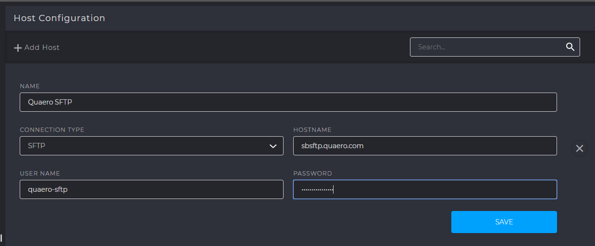

Host Configuration
##################

The primary function of the hosts is to configure an external source for the import or export of data,
such as to/from S3 Buckets, FTP servers or other external storage locations.
An external host is required in order to add new data sources in the Lake section of the CDP.
The same external host can be used for multiple data sources

Front End Configuration
***********************
Hosts can be added by navigating to :guilabel:`Settings > Host Configuration`

Metastore Tables
*****************

M_HOST    
^^^^^^
This table contains the details of the HOST that was created in the user interface. When a host is created, the records are inserted into this table.

:any:`HOST_HOSTNAME, HOST_DESC, HOST_USERNAME, HOST_PASSWORD, HOST_PORT`
    Represents the hostname, description, username, port and password of the host specified in the UI.

:any:`HOST_CATALOG`
    It is the name of the database in which the current environment is present. It is of the form ``EnvironmentName_DatabaseName``. Example: ``CDPTraining01_metastore``

:any:`HOST_CONNECTION_TYPE`
    It is the type of the host connection specified in the UI. Examples are SFTP, SQL Server, Hive etc.

    

