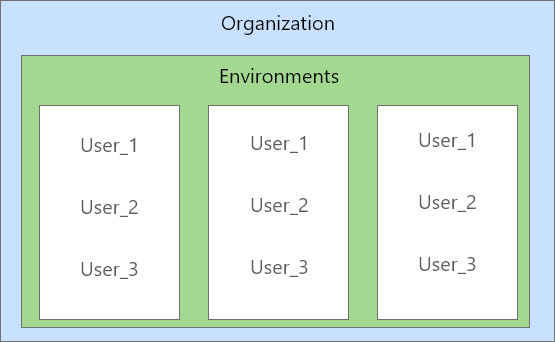

Introduction
#############

|   **Organization** 
|   Table containing information about the organization. In our case it’s QUAERO for internal use, and clients may use their own organization table.

|   **Environment**
|   An environment is a separate space within an organization where CDP can be used.
|   Within this environment many users may come together to work on data.
|   An organization can have many environments, and each environment can have many users.
|   The details of each environment are stored in the Environment table in the database.

|   Both the above tables constitute what is called as the USER STORE. This database is stored and managed on a remote AWS Server that is used and accessible only internally by ADMINS. Data relating to workflows and environment is stored in general servers depending on use cases (Such as a client may choose to store the environment in their own location).

|   **Environment Databases**
|   There are 5 databases within each environment:

1. **Metastore**      	This database stores the metadata of the CDP Environment.
2. **Staging**		    Stores raw data from different sources
3. **Master**		    Data stored after applying logic, cleansing, standardizing to a dataset instance.
4. **q-temp**	        When a workflow runs, temporary data/metadata need to be stored during execution. On completion, qtemp tables are automatically dropped.

*************
The Metastore
*************

The Metastore is the database within an environment that stores tracking information and contains metadata such as Errors, logs, Timings, status of workflows, etc.
Tables that start with **M_\*** contains information about connection, workflow configurations etc.
Tables that start with **M_TRACK_\*** contains tracking information.

|   1.	**M_GLOBAL_CONFIG**
|   This table contains the configuration of the entire CDP product. It has details about the product itself, such as the installation directory, port numbers, host names of various sources like Hive, Jira, Tableau. It also has the location of all the master packages which are used during CDP execution.

|   2.	**M_CLIENT** | :guilabel:`Client Creation`
|   It contains the details of the client such who is using the Environment, such as ESPN, or CDPTraining or UnderArmour, creator, date of creation and support email address of the client. When you add more clients, they are added to this table. One use case of the support email address is to send a mail to the client once a workflow finishes execution or if it fails.