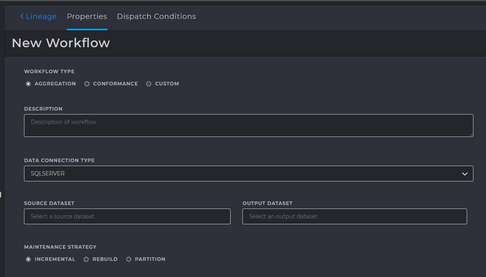
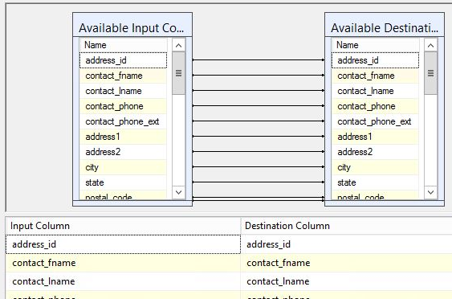
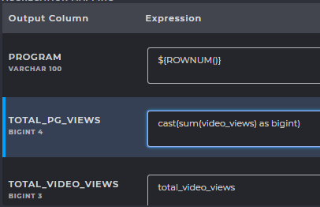
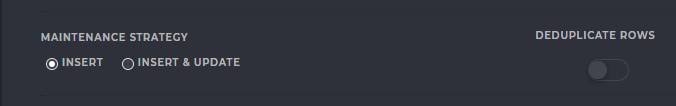
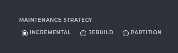
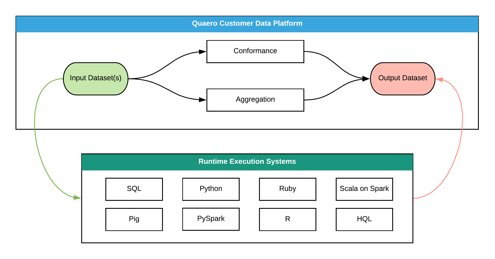
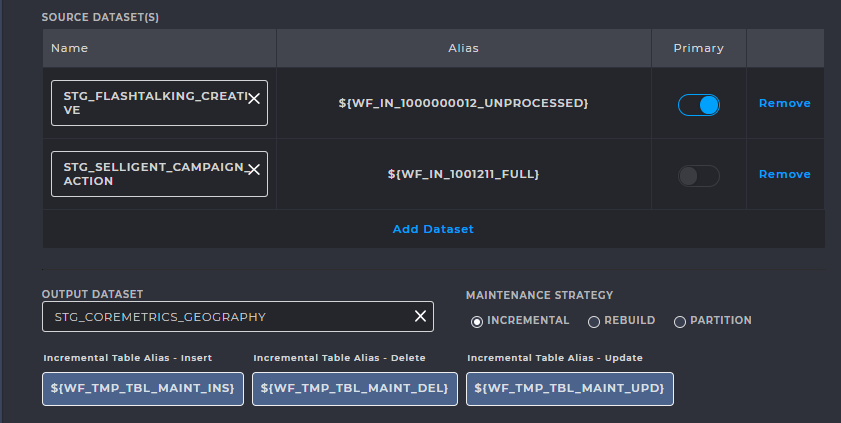
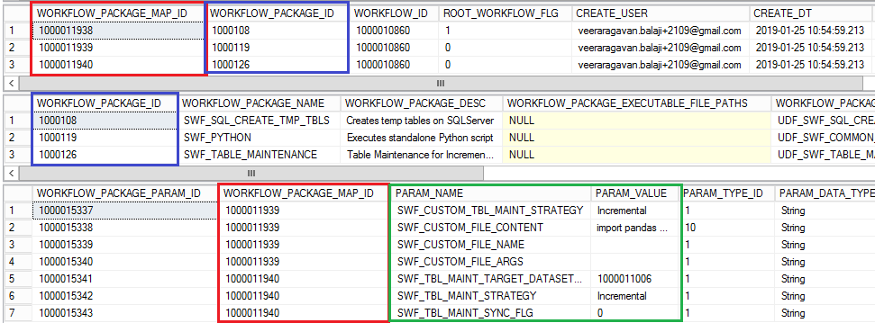
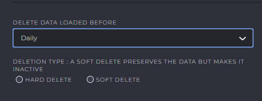

Workflows
########################

Introduction
************

|   **A workflow is a well-defined sequence of components that allow** `Extract, Transform and Load <https://en.wikipedia.org/wiki/Extract,_transform,_load>`_ **operations on a dataset.**
|   It is a Directed Acyclic Graph; whose input and output are both datasets.
    A workflow allows you to visualize the data flow throughout the system. A workflow is a fundamental entity
    in the QCDP architecture. It represents a data management process which operates on dataset instances.
    A workflow takes one or more dataset instances as input, operates on the input dataset instances and 
    creates (or updates) one or more dataset instances as output.

|   **Workflow Instance**
|   Strictly speaking, the term workflow represents the definition of a workflow; the instructions, tasks,
    parameters and types of datasets that the workflow accepts as input and creates as output.
    A workflow instance is a specific, running instance of a workflow. For example, a workflow might define a 
    particular sequence of processes that are to be executed upon rows in a particular database table. 
    A workflow instance is a specific and discreet execution of that workflow executing against a specific
    set of data, say the latest set of rows resulting from the import of an external file into a staging table. 
    This follows the object-oriented class and object instance model where many instances
    of the same class are generated

.. seealso::
    For more information about workflow execution, see :doc:`Execution Sequence <exec_seq>`

.. admonition:: PRIMARY TABLES

    :any:`M_WORKFLOW <M_WORKFLOW>` , :any:`M_WORKFLOW_INSTANCE_STATUS <M_WORKFLOW_INSTANCE_STATUS>` , :any:`M_WORKFLOW_TYPE <M_WORKFLOW_TYPE>` , :any:`M_WORKFLOW_INPUT <M_WORKFLOW_INPUT>` , :any:`M_WORKFLOW_EXECUTION_SUBSYSTEM <M_WORKFLOW_EXECUTION_SUBSYSTEM>`

.. _wf_map:

Workflow Mappings
=================

Every workflow takes a dataset as input and produces another dataset as output. 
After we create the source and destination tables, during the creation of workflows, we need 
to specify the source to destination column mappings similar to SSIS table mappings. 

.. admonition:: TABLES INVOLVED

    :any:`M_TABLE_CONFORMANCE_MAP <M_TABLE_CONFORMANCE_MAP>` , :any:`M_TABLE_AGGREGATION_MAP <M_TABLE_AGGREGATION_MAP>`

In the following figure, we can see that the left side ::guilabel:`Output Column` is the column name of the destination table and 
the right side :guilabel:`Expression` is the SQL expression to be applied on the source column. We can use any valid aggregate 
functions such as sum, count etc for Aggregate workflow and functions like cast, concat, substring for conformance workflows.
We can also use a function or variable within ``${ }`` to evaluate it during runtime. Example, ``${ROWNUM();}`` evaluates the row number
during run time and sets the value to the destination column. Specifying only the source column name will simply perform a 1:1 
mapping from source to destination.

Types of Workflows
==================
The following are the different types of workflows:

1. :ref:`Conformance Workflow <conf_wf>`
2. :ref:`Aggregate Workflow <agg_wf>`
3. :ref:`Custom Workflows <cust_wf>`
4. :ref:`Delete/Expiration Workflows <del_wf>`
5. :ref:`Extract & Transfer Workflows <et_wf>`

.. _conf_wf:

Conformance Workflows
*********************

|   A conformance workflow is one where one-to-one transformations take place from source column to destination column.
|   Examples include, typcasting, uppercase, lower case, substring operations etc..

Front End Configuration
=======================
|   In the user interface, we can create conformance workflows by 
|   :guilabel:`Selecting a dataset > Lineage > Add Workflow > Conformance`

.. _maint_strat:

Maintenance Strategy
--------------------
QCDP was designed to allow the creation of workflows 
and automate ETL operations at specified intervals. New and fresh data is constantly ingested and staged. 
There are a few strategies we can have, that resolves the problem of dealing with old data that is 
already staged and how the new data must be inserted into the existing tables. Let us discuss the few maintenance
strategies available in the QCDP

.. glossary::
    DE-DUPLICATE ROWS

        This option removes any duplicate rows in the table. 
        **A row is considered duplicate if and only if there exist two or more rows where ALL column values are identical**
        If any one of the column values are different, then the row is not identical and will not be removed. 
        It is usually safe for this option to be turned off if primary keys are specified.

.. glossary::
    INSERT

        When fresh data is available, selecting this option allows any new rows to be “inserted”
        and appended to the end of the table. The previous data remains and so the number of rows increases.
        **This option requires that NO PRIMARY KEYS be set in this table**. Any new data which contains rows with duplicate 
        column values, when inserted into a table with primary keys will violate the primary key constraint 
        and this option will fail the conformance workflow. We can conclude that enabling this option has the possibility
        of containing duplicate rows on insertion of new data. This can be avoided by enabling ``Deduplicate Rows`` if necessary.

.. glossary::
    INSERT & UPDATE

        This option allows insertion of rows with new data to the end of the table. For rows with duplicate column values,
        the existing row is updated instead. To make this possible, **we need to MAKE SURE PRIMARY KEYS EXIST in the table** so
        that duplicate values are updated instead of being appended at the end. If the new row is unique, it is simply appended.

.. admonition:: ONLY FOR NERDS...

        In SQL Server backend, all primary key tables are stored using Indexes.
        These indexes are basically `hash tables <https://en.wikipedia.org/wiki/Hash_table>`_, in the form of “key-value pairs”, whose ``key``
        is derived by applying a `Hash Function <https://en.wikipedia.org/wiki/Hash_function>`_ to the primary key. The ``value`` contains the column names of the table.
        We know that hash tables are the fastest data structure with an access time of ``O(1)`` time complexity.
        So, hashing a primary key allows direct insertion of data without performing a search.

Let us consider the insertion of new rows from fresh data into a table with this option enabled.
In such cases, the primary key of the new row is obtained.
We use a hashing function on this primary key, :any:`${HASHKEY(colname_or_expression)}`.
The destination table’s index is found, and the corresponding column values are updated. If the hash-key is not present in the existing table,
a new row is inserted at the end.

If composite keys are in the table, the HASHKEY function can be applied to any one of the primary keys that constitute the composite key. 
This is because a hash table is a two-dimensional structure with a key-value pair and requires the hashing of at-least one column in the table.
During creation of workflows, we can define the mappings as shown in figure :

.. image:: images/wf_3.png
    :width: 25em
    :align: center

If you fail to specify a HASHKEY function in the conformance expression, you will be greeted with the following error

.. error:: 	
    Executing the query "hashkey colummn required when @target_table_update..." failed with the following error: "Incorrect syntax near
    'required'.". Possible failure reasons: Problems with the query, "ResultSet" property not set correctly, 
    parameters not set correctly, or connection not established correctly.

.. admonition:: TABLES INVOLVED

   :any:`M_TABLE_CONFORMANCE <M_TABLE_CONFORMANCE>` , :any:`M_TABLE_CONFORMANCE_MAP <M_TABLE_CONFORMANCE_MAP>`
        
.. tip::
    For a more thorough understanding of maintenance strategy, :doc:`see this experiment <experiment>`

.. _agg_wf:

Aggregate Workflows
*********************
|   Aggregation workflow is used to change the grain of data by aggregating the incoming data on a filter expression
    (basically a key that consists of a column or set of columns) so that there is one output record for every corresponding key. 
    Ideally the output dataset should be a Fact Aggregate table but in certain circumstances a Fact table would be acceptable.
|   Examples include, typcasting, uppercase, lower case, substring operations etc..

Front End Configuration
=======================
|   In the user interface, we can create conformance workflows by 
|   :guilabel:`Selecting a dataset > Lineage > Add Workflow > Aggregation`

Maintenance Strategy
--------------------
:ref:`Similar to Conformance Workflow <maint_strat>`, there are a few strategies we can have, that resolves the problem of dealing with old data that is 
already staged and how the new data must be inserted into the existing tables. Let us discuss the few maintenance
strategies available for Aggregate Workflows

.. glossary::
    INCREMENTAL
        When fresh data is available, selecting this option allows any new rows to be aggregated and appended to the end of the table. The previous data, along with the new rows are aggregated together

.. glossary::
    REBUILD
        Every time the workflow executes, and fresh data is available, the table is truncated, and later aggregation is performed. This truncation of data followed by the aggregation is called “rebuild”

.. glossary::
    PARTITION         
            ``Intentionally left blank due to insufficient information. Please check back later``         

   
.. admonition:: TABLES INVOLVED

    :any:`M_TABLE_AGGREGATION <M_TABLE_AGGREGATION>` , :any:`M_TABLE_AGGREGATION_MAP <M_TABLE_AGGREGATION_MAP>`

.. _cust_wf:

Custom Workflows
****************

Front End Configuration
=======================
Oftentimes, there may be scenarios where complex aggregation and conformance operations may need to be performed that 
are tedious to do using the user interface. It may become necessary to handle such complex operations by handing 
off the data to a program outside the CDP Environment, performing the required operations and handing the resultant data back to CDP.
We can manipulate data using several languages, including SQL, Python, SAS, R etc. We design a “Specialized Workflow” that takes a
dataset as input and begins the execution of an external script (written in the above languages). This script extracts data from the 
CDP tables, and performs data transformations, complex aggregation and conformance. Later, the resultant data is written back to the
preconfigured destination table in CDP. This specialized workflow is one of the most useful features when it comes to users or developers
who might not be familiar with the languages supported by CDP and who wish to perform complex ETL operations.

We shall now look at the parts of a custom workflow and how it can be configured.

|   In the user interface, we can create custom workflows by 
|   :guilabel:`Selecting a dataset > Lineage > Add Workflow > Custom`

.. glossary::
    DATA CONNECTION TYPE
        Specifies the environment where the source/destination tables are present

.. glossary::
    SOURCE & OUTPUT DATASETS
        A custom workflow can have many input datasets and a single output dataset.
        If more output datasets are required, it can be included within the script    

.. glossary::
    ALIAS
        Because CDP hands over the datasets or tables to a script in an external environment, 
        the data is expose and is therefore less secure. CDP prepares an ALIAS that can be replaced within the script to refer to
        the actual table. An alias acts as a virtual name that allows CDP to point to the actual table without having to hard-code
        it within the script, thus making sure the script code stays constant, even if table names change, making a custom workflow more flexible.
        **For every maintenance strategy, an appropriate alias is to be used.**

.. glossary::
    PRIMARY TABLE
        Specifies the primary table used as a source table. Non primary tables are inner joined to the primary table
        This is equivalent to performing the following

        .. code-block:: SQL           

           select * from <primary_table> join <non_prim_1> join <non_prim_2> --and so on..

.. glossary::
    MAINTENANCE STRATEGY
        .. glossary::
            Incremental
                When fresh data is available, selecting this option allows any new rows to be aggregated and appended to the end of the table. 
                The previous data, along with the new rows are aggregated together

        .. glossary::
            Rebuild
                Every time the workflow executes, and fresh data is available, the table is truncated, and later aggregation is performed. 
                This truncation of data followed by the aggregation is called “rebuild”

        .. glossary::
            Partition
                ``Intentionally left blank due to insufficient information. Please check back later``

.. glossary::
    RUNTIME
        As mentioned previously, we can handle complex aggregations and ETL operations through external scripts 
        that are executed when the workflow starts. Theses scripts can be in any one of these currently supported languages:
        ``SQL, Python, Ruby, Scala on Spark, Pig, PySpark, R, HQL``. This can be specified in the :guilabel:`RUNTIME` dropdown menu,
        but please note that you CANNOT CHANGE this once the workflow has been customized.

.. glossary::
    CODE SCRIPT
        We can prepare a script that reads data from the source tables and writes back to the destination table.
        In the script, you must always make sure you use only the libraries that are available in the installation environment.
        You can check this by hovering over the :guilabel:`(i)` information icon beside the runtime name

        .. image:: images/wf_12.png
            :width: 25em
            :align: center
.. glossary::
    REPLACE WITH ALIAS
        During testing purposes, you may use the actual table name and hard code it. While pasting the code during workflow creation
        (or alternatively uploading), you can use the :guilabel:`Replace with Alias` function to automatically substitute the table 
        names with their alias. The alias works well when the fully qualified table name is specified ``(dbname.schemaname.tblname)``

        .. image:: images/wf_13.png
            :width: 50em
            :align: center
        

.. caution::
    1.	It is important to place appropriate comments within the code, so its easier to debug in production during script failures.
    2.	Please use ONLY the libraries specified, by hovering over the info icon.
    3.	It is important to use the same version of the scripting language as specified in the user interface. 
        Many functions may be added or deprecated in various versions, so please use non-volatile functions that are usually not bound to change during the language’s lifetime.
    4.	DO NOT hard code the Server connection details such as server name, username, password. There are Aliases 
        provided for these too, for use in scripts. Please see the sample code.

.. admonition:: Info

    |   You can read more in `QCDP Help Docs <http://ec2-34-205-146-140.compute-1.amazonaws.com/helpdoc/docs/tutorial/#set-up-a-specialized-python-workflow>`_
    |   You can get a sample `Python script from here <https://gist.github.com/rvndbalaji/dee3c026bbc1a290ba639f7a92aa67ab>`_	(Sample dataset source link inside script)

Backend Configuration
=====================

We can configure custom workflow from the backend by adding entries to a number of metastore tables

Querying the following tables after creation of a custom workflow can give us useful
insights and what entries are required. We’ll show only the custom workflow related entries
required for each table so as to remain concise.

.. glossary::
    :any:`M_WORKFLOW <M_WORKFLOW>`
        |   WORKFLOW_TYPE_ID				    -   (13) SPECIALIZED
        |   WORKFLOW_EXECUTION_SUBSYSTEM_ID	    -   (4)  Java Local (A local JVM installation executes the scripts)

.. glossary::
    :any:`M_WORKFLOW_INPUT`/ M_WORKFLOW_OUTPUT
        A specialized workflow may or may not have input and output datasets. This is optional,
        and a custom workflow can simply run or execute a script directly WITHOUT input or output datasets. 
        To perform just the execution of scripts, simply make no entries into these tables during creation.

.. glossary::
    :any:`M_WORKFLOW_PACKAGE`
        Custom workflows work by executing scripts written in one of the supported languages (Python, HQL etc..)
        For each language, CDP provides predefined packages that are responsible for executing the scripts. All packages can be referred 
        in ``M_WORKFLOW_PACKAGE`` table by querying for the respective language.

        .. code-block:: SQL

            select … PACKAGE_NAME like ‘%PYTHON%’, select … PACKAGE_NAME like ‘%SPARK%’

        .. image:: images/wf_14.png
            :width: 45em
            :align: center

.. glossary::
    :any:`M_WORKFLOW_PACKAGE_MAP`
        Once we’ve decided which packages are used, we must map each package to our custom workflow using the workflow ID. 
        This is easy to do as we just do a one to many mapping from WORKFLOW_ID to PACKAGE_ID. 
        For example, a custom workflow having WF_ID 1000010860 for executing Python script will have the mappings
        shown in the figure (shown at end of section).

.. glossary::
    :any:`M_WORKFLOW_PACKAGE_PARAM`
        Before executing any script, we may have to pass parameters such as variables, execution options etc similar 
        to how we do it in a command line or terminal. Since we’re creating a custom workflow by also specifying the code, we pass the
        entire code as a parameter to the packages which are responsible for executing the code. These packages each have parameters that 
        it can accept as a key value pair or a parameter name and parameter value. We can find these parameters defined in this table, 
        ``M_WORKFLOW_PACKAGE_PARAM``

Following are common package params:

    ========================================  =======================
    PARAM_NAME						            PARAM_VALUE
    ========================================  =======================
    SWF_CUSTOM_TBL_MAINT_STRATEGY			    Incremental
    SWF_CUSTOM_FILE_CONTENT				        ``import pandas..``
    SWF_EXEC_QUERY_SQL					        ``insert into table()``
    SWF_EXEC_QUERY_HOST_CONNECTION_PROTOCOL	    OLEDB
    SWF_EXEC_QUERY_HOST_ID				        1005xx
    ========================================  =======================

See the following figure to see how all the tables fit together

.. _del_wf:

Delete/Expiration Workflow
**************************
It is often necessary to delete data that is old, or which is not in use, to make room for fresh data.
We can set conditions for a dataset to “expire” to perform the act of labelling data that is no longer being used.
To perform expiration of a dataset, we create a Delete Workflow that executes when a certain “Expiration Condition” is met. 
When we set a dataset’s expiration condition, the Dataset Expiration Manager daemon job immediately drops such tables during routine cleanup

.. important::
   |    **Delete Workflow** is NOT to be confused with the act of **Deleting a workflow**
   |    A **Delete Workflow**, also called an **Expiration workflow** drops a table after a certain period.
   |    If you wish to delete an existing workflow run then run::

        .. code-block:: SQL

           EXEC USP_DELETE_WORKFLOW_CONFIG 100000xxxx, 'n'  --Provide Workflow_ID

Front End Configuration
=======================

In the user interface, we can configure expiration by :guilabel:`Selecting a dataset > Update`

.. warning::
    |   This feature is still under development in the front end
    |   Meanwhile, it can still be configured from the backend (next section)
    |   Please check back later for updates.

Backend Configuration
=======================

Perform the following steps to create a delete workflow

1.	:any:`EXEC USP_ADD_WORKFLOW` to insert a record to ``M_WORKFLOW``
2.	Set the expiration condition to your dataset using the ``DATASET_ID``. The example shows the query needed to perform a daily delete. You can change the ``where`` clause to change the interval.
3.	Set the expiration status ID to 5 (Expired). You can view the various statuses in :any:`M_DATASET_INSTANCE_SATUS <M_DATASET_INSTANCE_SATUS>`
4.	Activate the delete workflow by setting the ``ACTIVE_FLG`` to ``1``

.. code-block:: SQL
   :linenos:

    --Set Expiration condition for Daily Delete | Available in the User Interface
    declare @dataset_id bigint
    set @dataset_id = 1*****231		--Insert your DATASET_ID

    SELECT a.DATASET_INSTANCE_ID FROM M_TRACK_DATASET_INSTANCE a
    JOIN M_DATASET_INSTANCE_STATUS b ON a.STATUS_ID=b.STATUS_ID
    WHERE DATASET_ID = @dataset_id AND b.STATUS = 'READY' AND DATEDIFF(DAY,a.CREATE_DT,GETDATE())>=1

    update M_TRACK_DATASET_INSTANCE set status_id = 5 where DATASET_ID =  @dataset_id

If you wish to remove the expiration conditions and retain the data, set the expiration condition to ``null``,
set dataset status to 2 (READY) and deactivate the delete workflow

.. code-block:: SQL
   :linenos:

   --Remove expiration condition
   declare @dataset_id bigint
   set @dataset_id = 1*****231		--Insert your DATASET_ID

   update M_DATASET set expiration_condition = null, expiration_status_id = null where DATASET_ID = @dataset_id
   update M_TRACK_DATASET_INSTANCE set status_id = 2 where DATASET_ID =  @dataset_id

 
.. _et_wf:

Extract & Transfer Workflow
**************************

``This section will be updated soon. Please check back again later``

.. Front End Configuration
=======================

.. Backend End Configuration
=======================

Metastore Tables
****************

.. _M_WORKFLOW_INSTANCE_STATUS:

M_WORKFLOW_INSTANCE_STATUS
==========================
A workflow can be treated as a `deterministic finite automaton (state machine) <https://en.wikipedia.org/wiki/Deterministic_finite_automaton>`_ that contains a number of
states that the workflow can be in, at any given time during the execution. 
This table contains the list of all possible statuses the workflow can be in at any point in time during execution. 
The following table contains the statuses and the corresponding description.

=============  =================================   ========================================================================================================================
STATUS_ID      STATUS                              STATUS_DESC
=============  =================================   ========================================================================================================================
1	           READY                                Workflow is ready to have manifest built
2	           MANIFESTBUILDING                     Workflow's manifest is being built
3	           MANIFESTQUEUED                       Workflow's manifest is built and is queued for processing
4	           MANIFESTPROCESSING                   Workflow's manifest is being transferred to the processing location
5	           EXECUTING                            Workflow is currently being executed
6	           COMPLETE-PENDINGCLEANUP              Workflow execution completed successfully but manifest cleaned up failed
7	           COMPLETE-CLEANUPFAILED               Workflow execution completed successfully and manifest needs to be cleaned up
8	           COMPLETE                             Workflow execution and manifest cleanup completed successfully
9	           FAILED                               Workflow execution failed
10	           COMPLETE-PENDINGINSPECTION           Workflow execution completed successfully but there is some question as to the validity of the results
11	           FAILED-CLEANUPFAILED                 Workflow execution failed and manifest cleaned up failed
=============  =================================   ========================================================================================================================

.. _M_WORKFLOW:
 
M_WORKFLOW
==========
When a new workflow is created to manipulate data or perform operations, 
a record is added in this table for each and uniquely identifies that Workflow.

:any:`WORKFLOW_ID`
    It contains ``Workflow_ID`` that uniquely identifies each workflow.
    The existing convention is that all workflow IDs created manually are numbered starting from 1000000000, and all other entries
    less than that are WFs created automatically during environment setup and installation. 
    These standard WFs are inbuilt usually used for operations such as identity resolution and other CDP features.

:any:`CLIENT_ID`
    Represents which Client created the workflow

:any:`M_WORKFLOW_EXECUTION_SUBSYSTEM_ID`
	See :ref:`M_WORKFLOW_EXECUTION_SUBSYSTEM`

:any:`WOKFLOW_NAME, WORKFLOW_DESC`
    Name and description given to the workflow

:any:`WORKFLOW_TYPE_ID`
    See :ref:`M_WORKFLOW_TYPE`

:any:`REACTIVATE_FAILED_WORKFLOW_FLAG`
    If set to 1, it indicates whether the workflow must be reactivated automatically after a failure.

:any:`MAX_CONSECUTIVE_FAILED_WORKFLOW_REACTIVATIONS`
    Indicates the maximum number of reactivations allowed after consecutive failures.

:any:`REACTIVATE_FAILED_WORKFLOW_DELAY_SECS`    
    The delay in seconds before a failed workflow reactivates.

:any:`ACTIVE_FLG`
    If set to 1, indicates if the workflow is active. It is otherwise considered to be deactivated.

:any:`DISPATCH_CONDITION`    
    The dispatch condition specifies on what condition the workflow must be executed.    
    The Workflow Dispatcher Daemon Job constantly evaluates the dispatch condition and only when the condition is satisfied 
    the workflow begins execution.

    .. seealso:: For more information on Workflow Dispatcher, see :doc:`Execution Sequence <exec_seq>`

.. _M_WORKFLOW_TYPE:

M_WORKFLOW_TYPE
===============
This table contains the list of all workflow types and their ID which is used during creation of a workflow.
Examples are ``STAGING``, ``DOWNLOAD``, ``EXTRACT`` etc. More information about each type is provided in the
``WORKFLOW_TYPE_DESC`` attribute in this table. Every workflow type comes with a default ``DISPATCH_CONDITION``.

.. _M_WORKFLOW_INPUT:

M_WORKFLOW_INPUT
===============
Any input that is to be provided to the Workflow before beginning the execution is provided here.
The input and output for any given workflow is always a ``DATASET``. However, a custom workflow can be created without 
any input or output, or any one of them. For example, a workflow to send a mail or notification does not require 
any dataset as input, nor does it produce any output.  

:any:`DATASET_SCOPE`
    The type of data that is being given as input to the workflow. Types include ``File``, ``DATASET``, ``TABLE`` etc.

.. _M_DATASET:

M_DATASET
=========
Specifies the details of the input/output dataset for the workflow. ``OBJECT_TYPE`` attribute values can be ``File``, ``Query``, ``Table`` etc.

.. _M_WORKFLOW_PACKAGE:

M_WORKFLOW_PACKAGE
==================
During staging, workflow execution or any other operation, many pre-built packages must be executed, and the details of
these packages are present in this table. If you create your own workflow package, a record is added to this table along
with a unique ID. As shown in the below picture, the package ID, name, description and their installation path is provided.

.. _M_WORKFLOW_PACKAGE_PARAM:

M_WORKFLOW_PACKAGE_PARAM
=========================
All the parameters required for the execution of the workflow packages are recorded here for each package. 
They’re uniquely identified with ``WORKFLOW_PACKAGE_PARAM_ID`` and ``WORKFLOW_PACKAGE_MAP_ID``.

.. _M_WORKFLOW_PACKAGE_MAP:

M_WORKFLOW_PACKAGE_PARAM_MAP
============================
This table provides the mapping that binds the three workflow tables,
namely ``M_WORKFLOW_PACKAGE_PARAM``, ``M_WORKFLOW_PACKAGE`, and ``M_WORKFLOW``

.. _M_WORKFLOW_EXECUTION_SUBSYSTEM:

M_WORKFLOW_EXECUTION_SUBSYSTEM
==============================
This table contains all details about where the execution of the workflows takes place in the environment. 
For example, if you wish to execute SSIS packages (``WORKFLOW_EXECUTOR_TYPE``) then it is done using SQL Server
(which will be the ``WORKFLOW_EXECUTION_SUBSYSTEM_NAME``). So, in the front end, during creation of a workflow when one of 
the options is selected, the corresponding ``WORKFLOW_EXECUTION_SUBSYSTEM_ID`` is added to the table M_WORKFLOW.

.. seealso:: For more information on Workflow Execution Subsystem, see :doc:`Execution Sequence <exec_seq>`

.. _M_TABLE_CONFORMANCE:

M_TABLE_CONFORMANCE
===================
When :ref:`Conformance Workflow <conf_wf>` is created an entry is made to this table. 
It contains the Conformance workflow ID, input dataset and a unique output DATASET_ID is created. 

.. _M_TABLE_CONFORMANCE_MAP:

M_TABLE_CONFORMANCE_MAP
========================
During one to one transformations (conformance), this table provides the column mappings from source table to the destination table.

:any:`SOURCE_COLUMN_EXPRESSION`
    |   This column accepts an expression that represents what operation/transformation is performed on the source column.
    |   For example, if we wish to concatenate first and last names, then the expression will be ``concat(FirstName,LastName)`` and destination column name will be ``Full Name``
    |   All SQL built-in functions are valid expressions. Other operations include, ``cast``, ``substring``,``upper``,``lower`` etc.

:any:`TARGET_COLUMN_NAME`
    Specifies the column name in the destination table where the mapping from source column takes place during conformance. 

.. _M_TABLE_AGGREGATION:

M_TABLE_AGGREGATION
===================
When :ref:`Aggregation Workflow <agg_wf>` is created, an entry is made to this table.
It contains the aggregate workflow ID, input dataset and a unique ``AGGREGATE_DATASET_ID`` is created.

:any:`AGGREGATE_MAINTENANCE_STRATEGY`
    It is a load strategy and indicates whether the dataset load will be incremental (insert new records) or rebuild (full truncate and load).
    
:any:`FILTER_EXPRESSION`
    Filter_Expression column is to add filter to the aggregation query. 
    For eg. you want to select a subset of data from source table in case of a rebuild aggregate WF then you can add filter expression 
.. code-block:: SQL
     
   TO_DATE(PAGE_VIEW_DATE_TIME) < DATE_SUB(TO_DATE(FROM_UNIXTIME(UNIX_TIMESTAMP())),395)

.. _M_TABLE_AGGREGATION_MAP:

M_TABLE_AGGREGATION_MAP
========================
During aggregation, this table provides the column mappings from source table to the destination table.
This table is linked to the TABLE_AGGREGATION_ID column of the :ref:`M_TABLE_AGGREGATION <M_TABLE_AGGREGATION>` table 

.. seealso:: See also :ref:`Workflow Mappings <wf_map>`

:any:`SOURCE_COLUMN_EXPRESSION`
    |   This column accepts an expression that represents what aggregation is performed on the source column.
    |   For example, if we find the sum of all salaries in a column, then the expression will be ``sum(SALARY)``
    |   All SQL aggregation functions are valid expressions.

:any:`TARGET_COLUMN_NAME`
    Specifies the column name in the destination table where the mapping from source column takes place during aggregation. 

